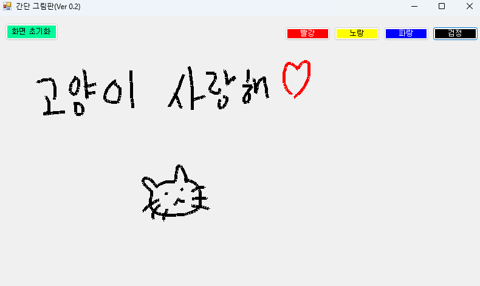

# 간단한 그림판 프로그램

이 프로젝트는 C#과 Windows Forms(WinForms)을 활용하여 개발한 간단한 그림판판입니다. WinForms 활용법을 익히고자 해당 프로젝트를 진행하였습니다.

## 프로젝트 소개

이 그림판은 마우스를 활용한 그림 그리기 기능을 제공합니다. 사용자 친화적인 인터페이스를 통해 손쉽게 그림을 그릴 수 있습니다.



## 프로젝트 개요
- 프로젝트 기간 (1일)
2025.01.17
- 프로젝트 인원 (1명)
이유찬

## 요구사항

- Windows 운영체제
- .NET Framework 4.7.2 이상
- Visual Studio 2017 이상

## 설치 및 실행 가이드

1. [프로젝트 저장소](https://github.com/Kamuie99/CS_Study/tree/master/Paint)를 클론하거나 ZIP 파일로 다운로드합니다.
2. Visual Studio에서 `Project02.sln` 파일을 엽니다.
3. 솔루션을 빌드하고 실행합니다.

## 폴더 구조

```
Paint/
├── Paint.sln
├── Paint/
│   ├── PaintForm.cs
│   ├── PaintForm.Designer.cs
│   ├── Program.cs
│   ├── Properties/
│   │   ├── AssemblyInfo.cs
│   │   ├── Resources.resx
│   │   └── Settings.settings
├── images/
│   └── Project02.png
```

## 기술 스택

- C#
- Windows Forms (WinForms)
- .NET Framework 4.7.2

## 주요 기능

- 간단그림판 Ver 0.1
  - 시작점(x, y좌표 값)과 끝점(x, y좌표 값)을 활용
  - 화면초기화 버튼을 통해 그림판 전체 지우기 가능
  - 현재 직선으로만 가능하지만, 추후 곡선도 가능하게 업데이트 예정
  
- 간단그림판 Ver 0.2
  - 펜 색깔을 빨강, 노랑, 파랑, 검정중 하나를 선택할 수 있음
  - 기존에는 직선으로 곡선을 표현할 수 없었는데, 이점을 보완
  - 곡선으로 그림을 그릴 수 있음

## 아키텍처

이 애플리케이션은 단일 폼(`Form1`)으로 구성되어 있습니다.

## 추후 업데이트 예정

- 그림을 좀 더 부드럽게 그리는 기능 추가
- 그림을 이미지로 저장하는 기능 추가가

자세한 내용은 [프로젝트 저장소](https://github.com/Kamuie99/CS_Study/tree/master/Paint)를 참고해주세요.