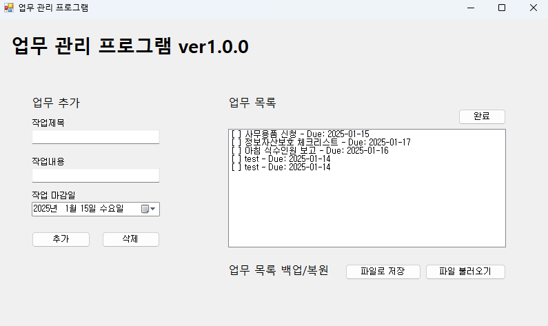

# 작업 관리자 애플리케이션 (TaskManagerApp)

이 프로젝트는 C#과 Windows Forms(WinForms)을 활용하여 개발한 작업 관리자(Task Manager) 애플리케이션입니다. 프로세스 관리 및 모니터링 기능을 제공하며, WinForms 활용법과 파일 저장/불러오기 기능을 익히기 위해 제작하였습니다. 

## 프로젝트 소개

TaskManagerApp은 현재 실행 중인 프로세스의 목록을 표시하고, 선택한 프로세스를 종료하는 기능을 제공합니다. 이를 통해 사용자는 시스템의 프로세스를 효율적으로 관리할 수 있습니다.
개발자는 해당 프로젝트를 통해 파일 저장/불러오기 기능의 숙달과 클래스화 및 상속의 기본기를 익힐 수 있습니다.

## 요구사항

- Windows 운영체제
- .NET Framework 4.7.2 이상
- Visual Studio 2019 이상

## 설치 및 실행 가이드

1. [프로젝트 저장소](https://github.com/Kamuie99/CS_Study/tree/master/TaskManagerApp)를 클론하거나 ZIP 파일로 다운로드합니다.
2. Visual Studio에서 `TaskManagerApp.sln` 파일을 엽니다.
3. 솔루션을 빌드하고 실행합니다.

## 폴더 구조

```
TaskManagerApp/
├── TaskManagerApp.sln
├── TaskManagerApp/
│   ├── TaskManagerForm.cs
│   ├── TaskManagerForm.Designer.cs
│   ├── Program.cs
│   ├── Properties/
│   │   ├── AssemblyInfo.cs
│   │   ├── Resources.resx
│   │   └── Settings.settings
├── images/
│   └── screenshot.png
```

## 실행 화면



## 기술 스택

- C#
- Windows Forms (WinForms)
- .NET Framework 4.7.2

## 주요 기능

- 업무 목록 추가 기능
- 업무 목록 삭제 기능
- 업무 목록을 파일로 저장(txt, xml, JSON) 기능
- 업무 목록을 파일로 불러오기(txt, xml, JSON) 기능
- 업무 목록에서 개별 업무를 완료/미완료 처리 기능

## 아키텍처

이 애플리케이션은 단일 폼(`TaskManagerForm`)으로 구성되어 있으며, 사용자 입력을 받아 현재 실행 중인 프로세스를 표시하고, 선택한 프로세스를 종료하는 기능을 제공합니다.

## 버전 관리

- **현재 버전**: 1.0.0
- **다음 예정 버전**: 1.2.0

## 추후 업데이트 예정
**ver.1.2.0**
- 데이터베이스(DB) 연동을 통한 프로세스 로그 기록 기능 추가
- 사용자 인터페이스(UI) 개선
- 코드 최적화 및 리팩토링

자세한 내용은 [프로젝트 저장소](https://github.com/Kamuie99/CS_Study/tree/master/TaskManagerApp)를 참고해주세요.